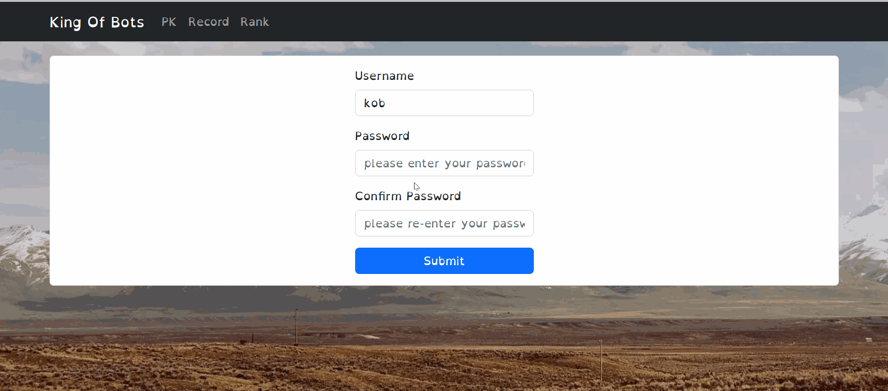
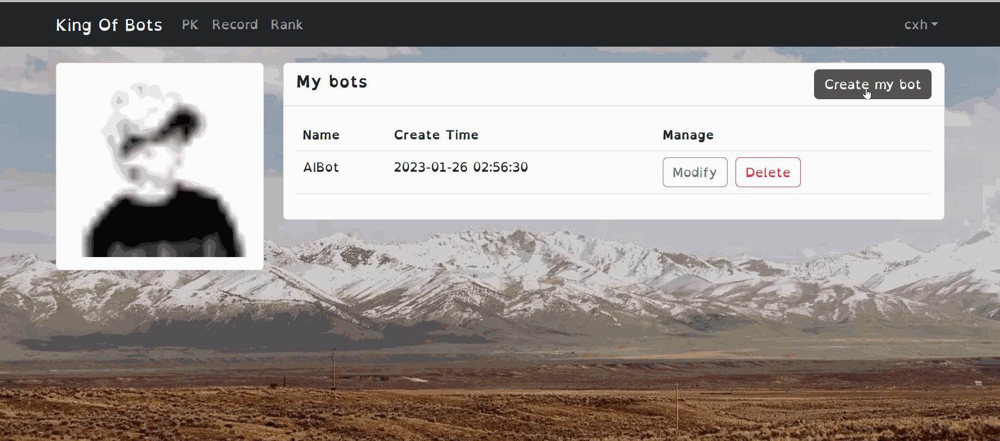
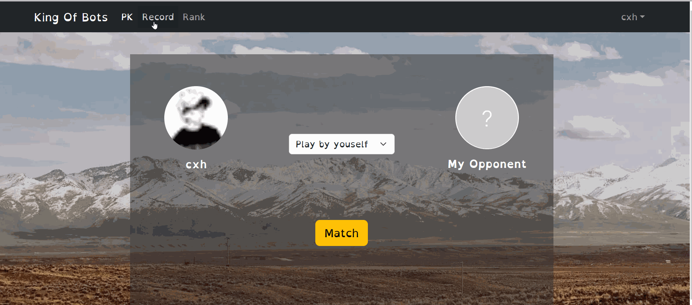
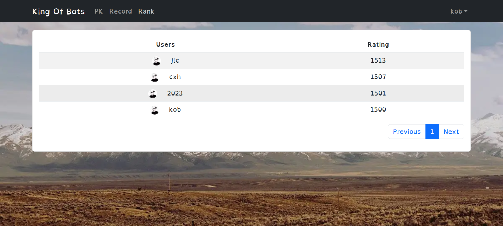

# Springboot & Vue & Mysql  - *Online Multiplayer Snake game*

Submitted by: **Xinhe Cheng**

[Try it here](https://app4561.acapp.acwing.com.cn/)

**King of Snake Bots** Created a multiplayer online battle game with microservices based on Vue, Springboot, and Mysql.

## Features

The following **required** functionality is completed:

- [x] **Users can register and log in, and the private information is encrypted with HmacSHA256.**
- [x] **Unregistered users can only access the login and registration pages. Include JWT tokens to limit authentication.**
- [x] **Contains a record page to replay recent pk records.**
- [x] **A rankings page is included to get the top players with the highest scores in this game.**
- [x] **Users can create, delete and modify their own AI bots to play, or play on the keyboard themselves.**
- [x] **User can see their list of items based on previously inputted items.**
- [x] **Maps are dynamically generated. The map is symmetrical to ensure fairness.**
- [x] **The intelligence matching system will match the players with closer scores with its best effort.**
- [x] **Users can register and log in, and the private information is encrypted with HmacSHA256.**
- [x] **User can see their list of items based on previously inputted items**

## Video Walkthrough

Here's a walkthrough of implemented user stories:

1. Register and login
  
&ensp;

2. We can play by ourselves with  keyboard. We can also play by the bots we design.    
         &ensp;&emsp;&emsp;  ↑  
         &ensp;&emsp;&emsp;  W  
 ← A &emsp; &ensp;D →  
       &ensp;&emsp;&emsp;   S  
       &ensp;&emsp;&emsp;    ↓ 
  
&ensp;

3. How to create a bot.
  
&ensp;

4. How to re-play the game record.

&ensp;

5. Show the rank of top players.
  
&ensp;

<!-- Replace this with whatever GIF tool you used! -->
GIF created with LICEcap 
<!-- Recommended tools:
[Kap](https://getkap.co/) for macOS
[ScreenToGif](https://www.screentogif.com/) for Windows
[peek](https://github.com/phw/peek) for Linux. -->

## Notes

### Microservices: 
Designed the intelligent players matching system by Spring Cloud, webSocket, and multithread. Utilized a built-in code compiler to support user-defined bots. Supported at least 100+ players online
at the same time.
### Deploy: 
Used Nginx to achieve load balancing strategy, and deployed the project containerized by docker.

## License

    Copyright [2022] [Xinhe Cheng]

    Licensed under the Apache License, Version 2.0 (the "License");
    you may not use this file except in compliance with the License.
    You may obtain a copy of the License at

        http://www.apache.org/licenses/LICENSE-2.0

    Unless required by applicable law or agreed to in writing, software
    distributed under the License is distributed on an "AS IS" BASIS,
    WITHOUT WARRANTIES OR CONDITIONS OF ANY KIND, either express or implied.
    See the License for the specific language governing permissions and
    limitations under the License.
